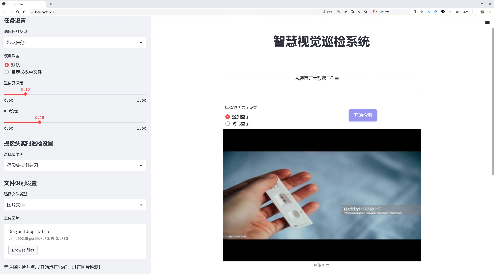
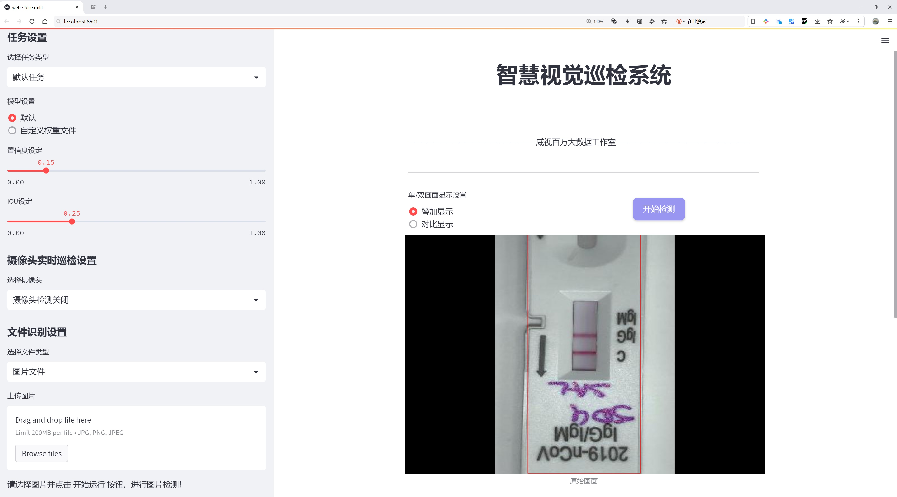
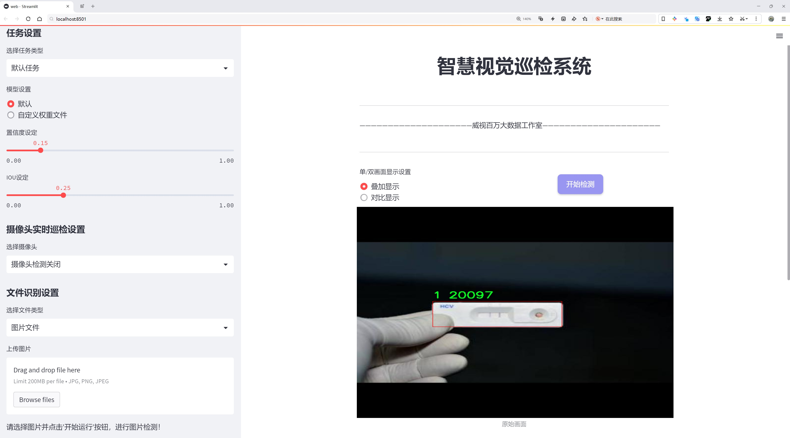
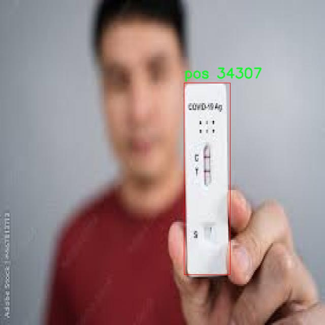
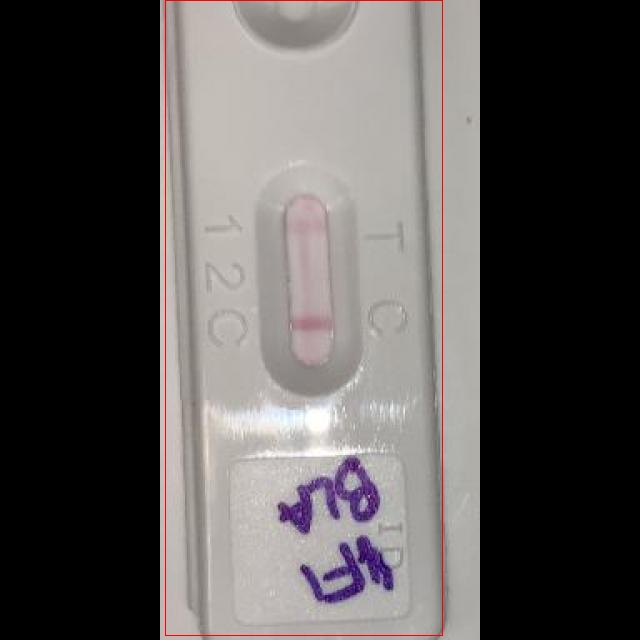

# 试剂盒检测结果识别检测系统源码分享
 # [一条龙教学YOLOV8标注好的数据集一键训练_70+全套改进创新点发刊_Web前端展示]

### 1.研究背景与意义

项目参考[AAAI Association for the Advancement of Artificial Intelligence](https://gitee.com/qunmasj/projects)

项目来源[AACV Association for the Advancement of Computer Vision](https://github.com/qunshansj/good)

研究背景与意义

随着生物技术的迅猛发展，试剂盒在医学诊断、环境监测及食品安全等领域的应用日益广泛。试剂盒的检测结果不仅直接影响实验室的工作效率，还对临床决策和公共健康具有重要意义。然而，传统的试剂盒检测方法往往依赖人工操作，容易受到人为因素的影响，导致结果的准确性和一致性不足。因此，开发一种高效、准确的自动化检测系统显得尤为重要。

近年来，深度学习技术在计算机视觉领域取得了显著进展，尤其是目标检测算法的不断优化与创新，使得自动化检测系统的实现成为可能。YOLO（You Only Look Once）系列模型以其快速、准确的特性，成为目标检测领域的佼佼者。YOLOv8作为该系列的最新版本，进一步提升了检测精度和速度，适用于实时检测场景。然而，尽管YOLOv8在多种应用中表现出色，但在特定领域如试剂盒检测中，仍然存在一些挑战，如样本不平衡、类别特征相似性等问题，这些问题可能导致模型在特定类别上的识别率下降。

本研究旨在基于改进的YOLOv8模型，构建一个高效的试剂盒检测结果识别系统。通过对现有YOLOv8模型进行优化，结合针对试剂盒检测的特定需求，设计出适合于该领域的目标检测算法。数据集的构建是本研究的基础，所使用的数据集包含2641张图像，涵盖4个类别（0、1、neg、pos），为模型的训练和验证提供了丰富的样本。这些类别分别代表了试剂盒检测结果的不同状态，其中“pos”表示阳性结果，“neg”表示阴性结果，而“0”和“1”则可能代表不同的检测指标或状态。这种多样化的类别设置为模型的学习提供了良好的基础。

在研究意义上，基于改进YOLOv8的试剂盒检测结果识别系统不仅能够提高检测的自动化水平，减少人工干预带来的误差，还能显著提升检测效率，降低检测成本。通过实现快速、准确的试剂盒检测结果识别，能够为实验室提供实时反馈，促进临床决策的及时性和准确性。此外，该系统的成功应用将为其他领域的自动化检测提供借鉴，推动相关技术的进一步发展。

综上所述，本研究不仅具有重要的理论价值，还具备广泛的应用前景。通过对YOLOv8模型的改进与优化，结合试剂盒检测的实际需求，构建高效的识别系统，将为生物医学、环境监测等领域的自动化检测提供有力支持，推动相关技术的进步与应用普及。

### 2.图片演示







##### 注意：由于此博客编辑较早，上面“2.图片演示”和“3.视频演示”展示的系统图片或者视频可能为老版本，新版本在老版本的基础上升级如下：（实际效果以升级的新版本为准）

  （1）适配了YOLOV8的“目标检测”模型和“实例分割”模型，通过加载相应的权重（.pt）文件即可自适应加载模型。

  （2）支持“图片识别”、“视频识别”、“摄像头实时识别”三种识别模式。

  （3）支持“图片识别”、“视频识别”、“摄像头实时识别”三种识别结果保存导出，解决手动导出（容易卡顿出现爆内存）存在的问题，识别完自动保存结果并导出到tempDir中。

  （4）支持Web前端系统中的标题、背景图等自定义修改，后面提供修改教程。

  另外本项目提供训练的数据集和训练教程,暂不提供权重文件（best.pt）,需要您按照教程进行训练后实现图片演示和Web前端界面演示的效果。

### 3.视频演示

[3.1 视频演示](https://www.bilibili.com/video/BV1XVHge8EWf/?vd_source=ff015de2d29cbe2a9cdbfa7064407a08)

### 4.数据集信息展示

数据集信息展示

本数据集专为改进YOLOv8的试剂盒检测结果识别系统而设计，旨在提升模型在特定应用场景下的检测精度和效率。数据集包含2641幅图像，涵盖了四个主要类别，分别为0、1、neg和pos。这些类别的划分不仅反映了不同的检测目标，还为模型的训练提供了丰富的多样性，确保其在实际应用中能够有效识别和分类不同类型的试剂盒。

在数据集的构建过程中，特别注重图像的多样性和代表性，以确保模型能够适应各种可能的场景。每一幅图像都经过精心挑选，确保其在不同的光照条件、背景复杂度以及试剂盒的不同外观特征下，均能提供有效的训练数据。这种多样性对于深度学习模型的训练至关重要，因为它能够帮助模型学习到更为广泛的特征，从而提高其在未见数据上的泛化能力。

数据集中每个类别的定义也经过深思熟虑。类别0和1代表了试剂盒的两种不同状态或类型，而neg和pos则分别表示负样本和正样本。这种分类方式使得模型在训练过程中能够清晰地理解不同类别之间的差异，从而在实际应用中做出更为准确的判断。例如，正样本（pos）可能代表符合检测标准的试剂盒，而负样本（neg）则代表不符合标准的试剂盒。这种明确的分类不仅有助于提高模型的检测精度，也为后续的结果分析提供了便利。

此外，本数据集遵循CC BY 4.0许可证，允许用户在遵循相关条款的前提下自由使用和修改数据。这种开放性不仅促进了学术界和工业界的合作，也为研究人员提供了更多的灵活性，使他们能够根据自身的需求对数据集进行调整和优化。

为了确保数据集的有效性和可靠性，所有图像均经过严格的质量控制，确保其清晰度和可用性。这一过程不仅提高了数据集的整体质量，也为模型的训练提供了坚实的基础。经过这样的精心准备，数据集能够为YOLOv8模型的训练提供强有力的支持，帮助其在试剂盒检测任务中取得更好的性能。

综上所述，本数据集的构建充分考虑了目标检测的需求，通过丰富的图像数量和明确的类别划分，为改进YOLOv8的试剂盒检测结果识别系统提供了理想的训练基础。随着深度学习技术的不断发展，期待该数据集能够为相关研究和应用带来积极的推动作用。







### 5.全套项目环境部署视频教程（零基础手把手教学）

[5.1 环境部署教程链接（零基础手把手教学）](https://www.ixigua.com/7404473917358506534?logTag=c807d0cbc21c0ef59de5)


[5.2 安装Python虚拟环境创建和依赖库安装视频教程链接（零基础手把手教学）](https://www.ixigua.com/7404474678003106304?logTag=1f1041108cd1f708b01a)

### 6.手把手YOLOV8训练视频教程（零基础小白有手就能学会）

[6.1 环境部署教程链接（零基础手把手教学）](https://www.ixigua.com/7404477157818401292?logTag=d31a2dfd1983c9668658)

### 7.70+种全套YOLOV8创新点代码加载调参视频教程（一键加载写好的改进模型的配置文件）

[7.1 环境部署教程链接（零基础手把手教学）](https://www.ixigua.com/7404478314661806627?logTag=29066f8288e3f4eea3a4)

### 8.70+种全套YOLOV8创新点原理讲解（非科班也可以轻松写刊发刊，V10版本正在科研待更新）

由于篇幅限制，每个创新点的具体原理讲解就不一一展开，具体见下列网址中的创新点对应子项目的技术原理博客网址【Blog】：


[8.1 70+种全套YOLOV8创新点原理讲解链接](https://gitee.com/qunmasj/good)

### 9.系统功能展示（检测对象为举例，实际内容以本项目数据集为准）

图9.1.系统支持检测结果表格显示

  图9.2.系统支持置信度和IOU阈值手动调节

  图9.3.系统支持自定义加载权重文件best.pt(需要你通过步骤5中训练获得)

  图9.4.系统支持摄像头实时识别

  图9.5.系统支持图片识别

  图9.6.系统支持视频识别

  图9.7.系统支持识别结果文件自动保存

  图9.8.系统支持Excel导出检测结果数据


### 10.原始YOLOV8算法原理

原始YOLOv8算法原理

YOLOv8是YOLO系列目标检测算法的最新版本，其设计理念是为了在检测精度和速度之间取得更好的平衡。相较于前代的YOLOv5，YOLOv8在多个方面进行了创新和改进，旨在提升模型的整体性能，特别是在实时检测场景中的应用。YOLOv8模型根据不同的需求和使用场景，提供了五种不同的版本：YOLOv8n、YOLOv8s、YOLOv8m、YOLOv8l和YOLOv8x。这些版本在网络深度和参数量上有所不同，用户可以根据具体的应用需求选择合适的模型。例如，YOLOv8n版本的参数量最小，检测速度最快，适合对实时性要求较高的应用场景。

YOLOv8的网络结构可以分为四个主要部分：输入端、骨干网络、颈部网络和头部网络。输入端的设计采用了马赛克数据增强、自适应锚框计算和自适应灰度填充等技术，以提高模型的鲁棒性和泛化能力。马赛克数据增强通过将多张图像拼接在一起，增加了训练样本的多样性，从而使模型在面对不同场景时能够更好地适应。然而，YOLOv8在训练的最后10个epoch中停止使用马赛克增强，以避免对数据真实分布的破坏，确保模型学习到有效的信息。

在骨干网络部分，YOLOv8引入了C2f模块，这一模块的设计灵感来源于YOLOv7的ELAN结构。C2f模块通过增加更多的分支和跨层连接，显著增强了模型的梯度流动性，从而提升了特征表示能力。C2f模块不仅保留了SPPF（Spatial Pyramid Pooling Fusion）结构的优势，还在执行时间上进行了优化，确保了模型的高效性。

颈部网络采用了路径聚合网络（PAN）结构，旨在加强不同尺度对象的特征融合能力。PAN结构通过有效地聚合来自不同层次的特征信息，使得模型在处理多尺度目标时能够更为准确地进行特征提取和融合。这一设计使得YOLOv8在面对复杂场景时，能够更好地捕捉到目标的多样性和复杂性。

头部网络是YOLOv8的另一个重要创新点。在这一部分，YOLOv8将分类和检测过程进行了有效的解耦，采用了当前流行的解耦头结构。分类头和检测头分别提取类别和位置特征，这种分离的设计使得模型在处理分类和定位任务时，能够更快地收敛并提高预测精度。分类任务主要关注特征图中提取到的特征与已知类别之间的相似性，而定位任务则更加关注边界框与真实框之间的位置关系。通过这种方式，YOLOv8能够在两个任务之间实现更好的协同效应。

在损失计算方面，YOLOv8采用了Task-Aligned Assigner策略来进行正负样本的分配。这一策略根据分类与回归的分数加权结果选择正样本，确保了模型在训练过程中能够更有效地学习到目标的特征。此外，YOLOv8在分类分支中使用了二元交叉熵损失（BCELoss），而在回归分支中则结合了分布焦点损失（DFLoss）和完全交并比损失（CIOULoss），以提升模型对边界框预测的精准性。

YOLOv8在整体结构上进行了精简和优化，特别是在头部网络中，去除了传统的锚框结构，转而采用无锚框检测头。这一改变不仅减少了锚框预测的数量，还加速了非最大抑制（NMS）过程，从而提升了模型的推理速度和检测效率。通过这些创新，YOLOv8在同等模型尺寸下，能够实现更高的检测精度和更快的推理速度，充分满足了实时目标检测的需求。

在实际应用中，YOLOv8模型在COCO数据集上的表现尤为突出，其mAP（mean Average Precision）指标在多个测试条件下均表现优异。这表明，YOLOv8不仅在理论上实现了多项技术创新，在实际应用中也具备了良好的性能表现，能够有效应对各种复杂的目标检测任务。

综上所述，YOLOv8通过对网络结构的深度优化和创新，特别是在骨干网络、颈部网络和头部网络的设计上，极大地提升了目标检测的精度和速度。其解耦头结构和无锚框设计的引入，使得YOLOv8在处理多种场景下的目标检测任务时，展现出了强大的适应性和灵活性。随着YOLOv8的推出，目标检测领域的研究和应用将迎来新的机遇和挑战，尤其是在实时性和准确性并重的任务中，YOLOv8无疑将成为一个重要的技术选择。


### 11.项目核心源码讲解（再也不用担心看不懂代码逻辑）

#### 11.1 ui.py

以下是经过简化和注释的核心代码部分：

```python
import sys
import subprocess
from QtFusion.path import abs_path

def run_script(script_path):
    """
    使用当前 Python 环境运行指定的脚本。

    Args:
        script_path (str): 要运行的脚本路径
    """
    # 获取当前 Python 解释器的路径
    python_path = sys.executable

    # 构建运行命令，使用 streamlit 运行指定的脚本
    command = f'"{python_path}" -m streamlit run "{script_path}"'

    # 执行命令并等待其完成
    result = subprocess.run(command, shell=True)
    
    # 检查命令执行结果，如果返回码不为0，则表示出错
    if result.returncode != 0:
        print("脚本运行出错。")

# 主程序入口
if __name__ == "__main__":
    # 获取脚本的绝对路径
    script_path = abs_path("web.py")

    # 运行指定的脚本
    run_script(script_path)
```

### 代码说明：
1. **导入模块**：
   - `sys`：用于获取当前 Python 解释器的路径。
   - `subprocess`：用于执行外部命令。
   - `abs_path`：从 `QtFusion.path` 导入的函数，用于获取文件的绝对路径。

2. **run_script 函数**：
   - 接受一个参数 `script_path`，表示要运行的 Python 脚本的路径。
   - 使用 `sys.executable` 获取当前 Python 解释器的路径。
   - 构建一个命令字符串，使用 `streamlit` 模块运行指定的脚本。
   - 使用 `subprocess.run` 执行构建的命令，并等待其完成。
   - 检查命令的返回码，如果不为0，表示脚本运行出错，打印错误信息。

3. **主程序入口**：
   - 使用 `abs_path` 获取 `web.py` 脚本的绝对路径。
   - 调用 `run_script` 函数来运行该脚本。

这个程序文件名为 `ui.py`，其主要功能是通过当前的 Python 环境运行一个指定的脚本，具体是一个名为 `web.py` 的文件。程序首先导入了必要的模块，包括 `sys`、`os` 和 `subprocess`，以及一个自定义的路径处理函数 `abs_path`。

在 `run_script` 函数中，首先获取当前 Python 解释器的路径，这样可以确保使用的是正确的 Python 环境。接着，构建一个命令字符串，该命令用于运行 `streamlit`，这是一个用于构建数据应用的库。命令中包含了 Python 解释器的路径和要运行的脚本路径。

随后，使用 `subprocess.run` 方法执行这个命令。这个方法会在一个新的子进程中运行命令，并等待其完成。如果命令执行的返回码不为零，表示脚本运行过程中出现了错误，此时会打印出“脚本运行出错”的提示。

在文件的最后部分，使用 `if __name__ == "__main__":` 语句来确保只有在直接运行该脚本时才会执行以下代码。这里指定了要运行的脚本路径，即 `web.py`，并调用 `run_script` 函数来执行这个脚本。

总的来说，这个文件的作用是为运行一个 Streamlit 应用提供了一个简单的界面，确保在正确的 Python 环境中执行指定的脚本。

#### 11.2 ultralytics\models\sam\modules\decoders.py

以下是经过简化和注释的核心代码部分：

```python
import torch
from torch import nn
from torch.nn import functional as F
from ultralytics.nn.modules import LayerNorm2d

class MaskDecoder(nn.Module):
    """
    MaskDecoder类用于生成图像的掩码及其质量评分，使用变换器架构根据图像和提示嵌入进行掩码预测。
    """

    def __init__(self, transformer_dim: int, transformer: nn.Module, num_multimask_outputs: int = 3, 
                 activation: Type[nn.Module] = nn.GELU, iou_head_depth: int = 3, 
                 iou_head_hidden_dim: int = 256) -> None:
        """
        初始化MaskDecoder类。

        Args:
            transformer_dim (int): 变换器模块的通道维度。
            transformer (nn.Module): 用于预测掩码的变换器。
            num_multimask_outputs (int): 预测的掩码数量。
            activation (nn.Module): 用于上采样掩码的激活函数类型。
            iou_head_depth (int): 用于预测掩码质量的MLP深度。
            iou_head_hidden_dim (int): 用于预测掩码质量的MLP隐藏维度。
        """
        super().__init__()
        self.transformer_dim = transformer_dim
        self.transformer = transformer
        self.num_multimask_outputs = num_multimask_outputs

        # IoU token和掩码token的嵌入
        self.iou_token = nn.Embedding(1, transformer_dim)
        self.mask_tokens = nn.Embedding(num_multimask_outputs + 1, transformer_dim)

        # 输出上采样网络
        self.output_upscaling = nn.Sequential(
            nn.ConvTranspose2d(transformer_dim, transformer_dim // 4, kernel_size=2, stride=2),
            LayerNorm2d(transformer_dim // 4),
            activation(),
            nn.ConvTranspose2d(transformer_dim // 4, transformer_dim // 8, kernel_size=2, stride=2),
            activation(),
        )

        # 生成掩码的超网络MLP
        self.output_hypernetworks_mlps = nn.ModuleList(
            [MLP(transformer_dim, transformer_dim, transformer_dim // 8, 3) for _ in range(num_multimask_outputs + 1)]
        )

        # 预测掩码质量的MLP
        self.iou_prediction_head = MLP(transformer_dim, iou_head_hidden_dim, num_multimask_outputs + 1, iou_head_depth)

    def forward(self, image_embeddings: torch.Tensor, image_pe: torch.Tensor, 
                sparse_prompt_embeddings: torch.Tensor, dense_prompt_embeddings: torch.Tensor, 
                multimask_output: bool) -> Tuple[torch.Tensor, torch.Tensor]:
        """
        根据图像和提示嵌入预测掩码。

        Args:
            image_embeddings (torch.Tensor): 图像编码器的嵌入。
            image_pe (torch.Tensor): 图像嵌入的位置信息。
            sparse_prompt_embeddings (torch.Tensor): 稀疏提示的嵌入。
            dense_prompt_embeddings (torch.Tensor): 密集提示的嵌入。
            multimask_output (bool): 是否返回多个掩码。

        Returns:
            torch.Tensor: 预测的掩码。
            torch.Tensor: 掩码质量的预测。
        """
        # 预测掩码和IoU评分
        masks, iou_pred = self.predict_masks(image_embeddings, image_pe, sparse_prompt_embeddings, dense_prompt_embeddings)

        # 根据是否需要多个掩码选择输出
        mask_slice = slice(1, None) if multimask_output else slice(0, 1)
        masks = masks[:, mask_slice, :, :]
        iou_pred = iou_pred[:, mask_slice]

        return masks, iou_pred

    def predict_masks(self, image_embeddings: torch.Tensor, image_pe: torch.Tensor, 
                      sparse_prompt_embeddings: torch.Tensor, dense_prompt_embeddings: torch.Tensor) -> Tuple[torch.Tensor, torch.Tensor]:
        """
        预测掩码。

        Args:
            image_embeddings (torch.Tensor): 图像编码器的嵌入。
            image_pe (torch.Tensor): 图像嵌入的位置信息。
            sparse_prompt_embeddings (torch.Tensor): 稀疏提示的嵌入。
            dense_prompt_embeddings (torch.Tensor): 密集提示的嵌入。

        Returns:
            Tuple[torch.Tensor, torch.Tensor]: 预测的掩码和IoU评分。
        """
        # 连接输出tokens
        output_tokens = torch.cat([self.iou_token.weight, self.mask_tokens.weight], dim=0)
        output_tokens = output_tokens.unsqueeze(0).expand(sparse_prompt_embeddings.size(0), -1, -1)
        tokens = torch.cat((output_tokens, sparse_prompt_embeddings), dim=1)

        # 扩展每个图像的数据以适应每个掩码
        src = torch.repeat_interleave(image_embeddings, tokens.shape[0], dim=0) + dense_prompt_embeddings
        pos_src = torch.repeat_interleave(image_pe, tokens.shape[0], dim=0)

        # 运行变换器
        hs, src = self.transformer(src, pos_src, tokens)
        iou_token_out = hs[:, 0, :]
        mask_tokens_out = hs[:, 1 : (1 + self.num_multimask_outputs + 1), :]

        # 上采样掩码嵌入并预测掩码
        src = src.transpose(1, 2).view(src.shape[0], self.transformer_dim, -1)
        upscaled_embedding = self.output_upscaling(src)
        hyper_in_list = [self.output_hypernetworks_mlps[i](mask_tokens_out[:, i, :]) for i in range(self.num_multimask_outputs + 1)]
        hyper_in = torch.stack(hyper_in_list, dim=1)
        masks = (hyper_in @ upscaled_embedding.view(upscaled_embedding.shape[0], -1)).view(upscaled_embedding.shape[0], -1, int(upscaled_embedding.shape[2]**0.5), int(upscaled_embedding.shape[2]**0.5))

        # 生成掩码质量预测
        iou_pred = self.iou_prediction_head(iou_token_out)

        return masks, iou_pred

class MLP(nn.Module):
    """
    MLP（多层感知器）模型，用于掩码质量预测。
    """

    def __init__(self, input_dim: int, hidden_dim: int, output_dim: int, num_layers: int) -> None:
        """
        初始化MLP模型。

        Args:
            input_dim (int): 输入特征的维度。
            hidden_dim (int): 隐藏层的维度。
            output_dim (int): 输出层的维度。
            num_layers (int): 隐藏层的数量。
        """
        super().__init__()
        self.layers = nn.ModuleList(nn.Linear(n, k) for n, k in zip([input_dim] + [hidden_dim] * (num_layers - 1), 
                                                                      [hidden_dim] * (num_layers - 1) + [output_dim]))

    def forward(self, x):
        """执行前向传播并应用激活函数。"""
        for i, layer in enumerate(self.layers):
            x = F.relu(layer(x)) if i < len(self.layers) - 1 else layer(x)
        return x
```

### 代码注释说明：
1. **MaskDecoder类**：该类用于生成图像的掩码和质量评分，使用变换器架构。
2. **__init__方法**：初始化类的属性，包括变换器维度、掩码和IoU token的嵌入、输出上采样网络和掩码质量预测的MLP。
3. **forward方法**：根据输入的图像和提示嵌入预测掩码，并根据需要选择返回多个掩码或单个掩码。
4. **predict_masks方法**：实现掩码的具体预测逻辑，包括连接tokens、扩展图像数据、运行变换器、上采样掩码嵌入以及生成掩码质量预测。
5. **MLP类**：定义一个多层感知器，用于掩码质量的预测，包含前向传播的实现。

这个程序文件定义了一个名为 `MaskDecoder` 的类，主要用于生成图像的掩膜及其相关的质量评分。该类使用了变换器（transformer）架构来预测掩膜，输入包括图像和提示嵌入。程序中还定义了一个辅助的多层感知器（MLP）类，用于处理一些特定的计算。

在 `MaskDecoder` 类的构造函数中，初始化了一些重要的属性，包括变换器的维度、变换器模块、要预测的掩膜数量、IoU（Intersection over Union）标记的嵌入、掩膜标记的嵌入以及用于输出上采样的神经网络序列。输出上采样的过程使用了转置卷积层和层归一化，并结合了激活函数。

`forward` 方法是该类的主要接口，接受图像嵌入、位置编码、稀疏提示嵌入和密集提示嵌入等参数，并返回预测的掩膜和掩膜质量评分。该方法首先调用 `predict_masks` 方法来生成掩膜和质量评分，然后根据是否需要多掩膜输出来选择合适的掩膜进行返回。

`predict_masks` 方法具体实现了掩膜的预测过程。它首先将 IoU 标记和掩膜标记的嵌入进行拼接，并扩展为每个图像的掩膜数据。接着，将图像嵌入与密集提示嵌入相加，并通过变换器进行处理。变换器的输出用于生成掩膜的嵌入，并通过上采样网络进行处理，最终得到预测的掩膜。与此同时，IoU 标记的输出被送入 MLP 以生成掩膜质量的预测。

`MLP` 类则是一个简单的多层感知器实现，支持多层结构和可选的 Sigmoid 激活函数。它的构造函数接受输入维度、隐藏层维度、输出维度和层数等参数，并根据这些参数构建相应的线性层。`forward` 方法则实现了前向传播的过程，逐层通过激活函数处理输入数据。

整体来看，这个程序文件实现了一个基于变换器的掩膜解码器，能够根据输入的图像和提示信息生成相应的掩膜及其质量评分，适用于图像分割等任务。

#### 11.3 ultralytics\nn\autobackend.py

以下是代码中最核心的部分，并附上详细的中文注释：

```python
class AutoBackend(nn.Module):
    """
    处理 Ultralytics YOLO 模型的动态后端选择，用于推理。
    该类提供了一个抽象层，支持多种模型格式和推理引擎。
    """

    @torch.no_grad()
    def __init__(self, weights="yolov8n.pt", device=torch.device("cpu"), fp16=False, fuse=True, verbose=True):
        """
        初始化 AutoBackend 以进行推理。

        参数:
            weights (str): 模型权重文件的路径，默认为 'yolov8n.pt'。
            device (torch.device): 运行模型的设备，默认为 CPU。
            fp16 (bool): 启用半精度推理，仅在特定后端支持。默认为 False。
            fuse (bool): 融合 Conv2D + BatchNorm 层以优化性能。默认为 True。
            verbose (bool): 启用详细日志记录。默认为 True。
        """
        super().__init__()
        w = str(weights[0] if isinstance(weights, list) else weights)  # 确保权重路径为字符串
        pt, jit, onnx, xml, engine, coreml, saved_model, pb, tflite, edgetpu, tfjs, paddle, ncnn, triton = self._model_type(w)

        # 设置设备
        cuda = torch.cuda.is_available() and device.type != "cpu"  # 检查是否可用 CUDA
        if cuda and not any([pt, jit, engine, onnx]):  # 如果没有使用的模型格式，强制使用 CPU
            device = torch.device("cpu")
            cuda = False

        # 加载模型
        if pt:  # 如果是 PyTorch 模型
            from ultralytics.nn.tasks import attempt_load_weights
            model = attempt_load_weights(weights if isinstance(weights, list) else w, device=device, inplace=True, fuse=fuse)
        elif onnx:  # 如果是 ONNX 模型
            import onnxruntime
            session = onnxruntime.InferenceSession(w)  # 创建 ONNX 推理会话
        # 其他模型格式的加载逻辑省略...

        # 检查类名
        if "names" not in locals():  # 如果类名缺失
            names = default_class_names(data)  # 使用默认类名
        names = check_class_names(names)  # 检查类名的有效性

        # 禁用梯度
        if pt:
            for p in model.parameters():
                p.requires_grad = False  # 不需要计算梯度

        self.__dict__.update(locals())  # 将所有局部变量赋值给实例

    def forward(self, im, augment=False, visualize=False, embed=None):
        """
        在 YOLOv8 MultiBackend 模型上运行推理。

        参数:
            im (torch.Tensor): 要进行推理的图像张量。
            augment (bool): 是否在推理期间执行数据增强，默认为 False。
            visualize (bool): 是否可视化输出预测，默认为 False。
            embed (list, optional): 要返回的特征向量/嵌入的列表。

        返回:
            (tuple): 包含原始输出张量和可视化处理输出的元组（如果 visualize=True）。
        """
        b, ch, h, w = im.shape  # 获取输入图像的形状
        if self.fp16 and im.dtype != torch.float16:
            im = im.half()  # 转换为 FP16
        # 根据模型类型执行推理
        if self.pt:  # PyTorch
            y = self.model(im, augment=augment, visualize=visualize, embed=embed)
        elif self.onnx:  # ONNX Runtime
            im = im.cpu().numpy()  # 转换为 numpy 数组
            y = self.session.run(self.output_names, {self.session.get_inputs()[0].name: im})
        # 其他模型推理逻辑省略...

        return self.from_numpy(y)  # 将输出转换为张量并返回

    def from_numpy(self, x):
        """
        将 numpy 数组转换为张量。

        参数:
            x (np.ndarray): 要转换的数组。

        返回:
            (torch.Tensor): 转换后的张量。
        """
        return torch.tensor(x).to(self.device) if isinstance(x, np.ndarray) else x

    @staticmethod
    def _model_type(p="path/to/model.pt"):
        """
        根据模型文件路径返回模型类型。

        参数:
            p: 模型文件的路径，默认为 'path/to/model.pt'。
        """
        # 返回模型类型
        from ultralytics.engine.exporter import export_formats
        sf = list(export_formats().Suffix)  # 获取支持的后缀
        name = Path(p).name
        types = [s in name for s in sf]  # 检查文件名中是否包含支持的后缀
        return types  # 返回模型类型列表
```

### 代码核心部分说明：
1. **AutoBackend 类**：该类负责处理不同模型格式的加载和推理，支持多种后端。
2. **__init__ 方法**：初始化模型，加载权重，并设置设备和其他参数。
3. **forward 方法**：执行推理，处理输入图像，并根据模型类型返回输出。
4. **from_numpy 方法**：将 numpy 数组转换为 PyTorch 张量。
5. **_model_type 方法**：根据模型文件路径返回模型类型，用于确定如何加载模型。

这些部分是实现 YOLO 模型推理的核心逻辑，确保了模型的灵活性和可扩展性。

这个程序文件 `ultralytics/nn/autobackend.py` 是 Ultralytics YOLO 模型的一个重要组成部分，主要负责动态选择后端以运行推理。它支持多种模型格式，包括 PyTorch、ONNX、TensorFlow 等，并提供了相应的接口来加载和推理这些模型。

文件开头导入了一些必要的库，包括标准库和第三方库，如 `torch`、`cv2` 和 `numpy`，这些库为模型的加载和推理提供了基础功能。接着定义了一些辅助函数，例如 `check_class_names` 和 `default_class_names`，用于检查和处理类别名称，确保它们符合模型的要求。

`AutoBackend` 类是文件的核心部分，继承自 `torch.nn.Module`。它的构造函数接受多个参数，包括模型权重文件的路径、设备类型（CPU 或 GPU）、是否使用 DNN 模块进行推理、数据文件路径、是否启用半精度推理等。构造函数首先确定模型的类型，然后根据模型类型加载相应的模型，并处理模型的元数据。

在模型加载过程中，`AutoBackend` 支持多种格式的模型，包括 PyTorch、TorchScript、ONNX、OpenVINO、TensorRT、CoreML 等。根据不同的模型格式，使用不同的库和方法进行加载。例如，对于 PyTorch 模型，使用 `attempt_load_weights` 函数加载权重；对于 ONNX 模型，使用 `onnxruntime` 进行推理；对于 TensorRT 模型，使用 `tensorrt` 库。

`forward` 方法是模型推理的主要逻辑，接受一个图像张量作为输入，并根据模型类型执行推理。该方法处理输入数据的格式转换，并调用相应的推理方法。最终返回推理结果，可能包括原始输出和可视化输出。

此外，`warmup` 方法用于预热模型，通过运行一次前向推理来提高后续推理的速度。`_model_type` 静态方法用于根据模型文件路径确定模型的类型，确保支持的格式可以被正确识别。

总的来说，这个文件实现了一个灵活的后端选择机制，使得用户可以方便地在不同的硬件和软件环境中运行 YOLO 模型，同时支持多种模型格式的加载和推理。

#### 11.4 log.py

以下是代码中最核心的部分，并附上详细的中文注释：

```python
import os
import time
import cv2
import pandas as pd
from PIL import Image

def save_chinese_image(file_path, image_array):
    """
    保存带有中文路径的图片文件

    参数：
    file_path (str): 图片的保存路径，应包含中文字符, 例如 '示例路径/含有中文的文件名.png'
    image_array (numpy.ndarray): 要保存的 OpenCV 图像（即 numpy 数组）
    """
    try:
        # 将 OpenCV 图片转换为 Pillow Image 对象
        image = Image.fromarray(cv2.cvtColor(image_array, cv2.COLOR_BGR2RGB))

        # 使用 Pillow 保存图片文件
        image.save(file_path)

        print(f"成功保存图像到: {file_path}")
    except Exception as e:
        print(f"保存图像失败: {str(e)}")

class ResultLogger:
    def __init__(self):
        """
        初始化ResultLogger类。
        """
        # 创建一个空的DataFrame用于存储识别结果
        self.results_df = pd.DataFrame(columns=["识别结果", "位置", "面积", "时间"])

    def concat_results(self, result, location, confidence, time):
        """
        将检测结果添加到结果DataFrame中。

        参数：
            result (str): 检测结果。
            location (str): 检测位置。
            confidence (str): 置信度。
            time (str): 检出目标所在时间。

        返回：
            pd.DataFrame: 更新后的DataFrame。
        """
        # 创建一个包含这些信息的字典
        result_data = {
            "识别结果": [result],
            "位置": [location],
            "面积": [confidence],
            "时间": [time]
        }

        # 创建一个新的DataFrame并将其添加到实例的DataFrame
        new_row = pd.DataFrame(result_data)
        self.results_df = pd.concat([self.results_df, new_row], ignore_index=True)

        return self.results_df

class LogTable:
    def __init__(self, csv_file_path=None):
        """
        初始化类实例。

        参数：
            csv_file_path (str): 保存初始数据的CSV文件路径。
        """
        self.csv_file_path = csv_file_path
        # 初始化用于保存图像和结果的列表
        self.saved_images = []
        self.saved_results = []

        # 定义DataFrame的列名
        columns = ['文件路径', '识别结果', '位置', '面积', '时间']

        # 尝试从CSV文件加载数据，如果失败则创建一个空的DataFrame
        try:
            if not os.path.exists(csv_file_path):
                # 如果文件不存在，创建一个带有初始表头的空DataFrame并保存为CSV文件
                empty_df = pd.DataFrame(columns=columns)
                empty_df.to_csv(csv_file_path, index=False, header=True)

            self.data = pd.DataFrame(columns=columns)
        except (FileNotFoundError, pd.errors.EmptyDataError):
            self.data = pd.DataFrame(columns=columns)

    def add_log_entry(self, file_path, recognition_result, position, confidence, time_spent):
        """
        向日志中添加一条新记录。

        参数：
            file_path (str): 文件路径
            recognition_result (str): 识别结果
            position (str): 位置
            confidence (float): 置信度
            time_spent (float): 用时（通常是秒或毫秒）

        返回：
            None
        """
        # 创建新的数据行
        new_entry = pd.DataFrame([[file_path, recognition_result, position, confidence, time_spent]],
                                 columns=['文件路径', '识别结果', '位置', '面积', '时间'])

        # 将新行添加到DataFrame中
        self.data = pd.concat([new_entry, self.data]).reset_index(drop=True)

    def save_to_csv(self):
        """
        将更新后的DataFrame保存到CSV文件。
        """
        self.data.to_csv(self.csv_file_path, index=False, encoding='utf-8', mode='a', header=False)

    def update_table(self, log_table_placeholder):
        """
        更新表格，显示最新的500条记录。

        参数：
            log_table_placeholder: Streamlit的表格占位符

        返回：
            None
        """
        # 判断DataFrame的长度是否超过500
        if len(self.data) > 500:
            # 如果超过500，仅显示最新的500条记录
            display_data = self.data.head(500)
        else:
            # 如果不超过，显示全部数据
            display_data = self.data

        log_table_placeholder.table(display_data)
```

### 代码核心部分解释：
1. **保存带有中文路径的图片**：`save_chinese_image` 函数用于将图像保存到指定路径，支持中文路径。
2. **结果记录器**：`ResultLogger` 类用于记录识别结果，包括识别结果、位置、面积和时间。
3. **日志表**：`LogTable` 类用于管理日志数据，包括从CSV文件加载数据、添加新记录、保存到CSV文件以及更新显示的表格。

这些核心部分实现了图像保存和结果记录的基本功能，适用于需要处理图像和记录结果的应用场景。

这个程序文件 `log.py` 主要用于处理图像和日志记录，特别是在图像识别或检测任务中。程序中使用了多个库，包括 `os`、`time`、`cv2`（OpenCV）、`pandas`、`PIL`（Pillow）、`numpy` 和 `datetime`，这些库为图像处理和数据管理提供了强大的支持。

首先，程序定义了一个 `save_chinese_image` 函数，用于保存带有中文路径的图像文件。该函数接受两个参数：文件路径和图像数组。它尝试将 OpenCV 格式的图像转换为 Pillow 图像对象，然后使用 Pillow 保存图像。如果保存成功，会打印成功信息；如果失败，则会捕获异常并打印错误信息。

接下来，定义了一个 `ResultLogger` 类。该类的初始化方法创建了一个空的 Pandas DataFrame，用于存储识别结果、位置、面积和时间等信息。`concat_results` 方法用于将检测结果添加到 DataFrame 中，接收检测结果、位置、置信度和时间作为参数，并将这些信息存储为新的行。

然后是 `LogTable` 类，它用于管理日志数据和图像帧。初始化时，它尝试从指定的 CSV 文件加载数据，如果文件不存在，则创建一个空的 DataFrame。该类包含多个方法，包括 `add_frames`（添加图像和检测信息）、`clear_frames`（清空存储的图像和结果）、`save_frames_file`（保存图像或视频文件）、`add_log_entry`（向日志中添加新记录）、`clear_data`（清空数据）、`save_to_csv`（将数据保存到 CSV 文件）和 `update_table`（更新表格以显示最新的记录）。

在 `save_frames_file` 方法中，如果保存的图像列表不为空，则根据图像数量决定是保存为单张图片还是视频。如果只有一张图像，则保存为 PNG 格式；如果有多张图像，则将它们合成为 AVI 格式的视频。该方法还会生成带有时间戳的文件名，确保文件的唯一性。

`add_log_entry` 方法用于向日志中添加一条新记录，包括文件路径、识别结果、位置、置信度和时间。每次调用该方法时，都会将新记录添加到 DataFrame 的顶部。

最后，`update_table` 方法用于更新表格显示，最多显示最新的 500 条记录，适用于与 Streamlit 等可视化工具结合使用。

总体而言，这个程序文件提供了一整套用于图像处理和结果记录的功能，适合在图像识别或监控系统中使用。

#### 11.5 ultralytics\data\explorer\gui\dash.py

以下是代码中最核心的部分，并附上详细的中文注释：

```python
import time
from threading import Thread
import streamlit as st
from ultralytics import Explorer

def _get_explorer():
    """初始化并返回Explorer类的实例。"""
    # 从session_state中获取数据集和模型
    exp = Explorer(data=st.session_state.get("dataset"), model=st.session_state.get("model"))
    
    # 创建一个线程来生成嵌入表
    thread = Thread(
        target=exp.create_embeddings_table, 
        kwargs={"force": st.session_state.get("force_recreate_embeddings")}
    )
    thread.start()  # 启动线程

    # 创建进度条以显示嵌入表创建的进度
    progress_bar = st.progress(0, text="Creating embeddings table...")
    while exp.progress < 1:  # 当进度小于1时持续更新进度条
        time.sleep(0.1)  # 每0.1秒检查一次进度
        progress_bar.progress(exp.progress, text=f"Progress: {exp.progress * 100}%")  # 更新进度条
    thread.join()  # 等待线程完成
    st.session_state["explorer"] = exp  # 将生成的Explorer实例存入session_state
    progress_bar.empty()  # 清空进度条

def init_explorer_form():
    """初始化Explorer实例并创建嵌入表，同时跟踪进度。"""
    # 获取数据集的路径
    datasets = ROOT / "cfg" / "datasets"
    ds = [d.name for d in datasets.glob("*.yaml")]  # 获取所有数据集文件名
    models = [
        "yolov8n.pt", "yolov8s.pt", "yolov8m.pt", 
        "yolov8l.pt", "yolov8x.pt", "yolov8n-seg.pt", 
        "yolov8s-seg.pt", "yolov8m-seg.pt", "yolov8l-seg.pt", 
        "yolov8x-seg.pt", "yolov8n-pose.pt", "yolov8s-pose.pt", 
        "yolov8m-pose.pt", "yolov8l-pose.pt", "yolov8x-pose.pt",
    ]
    
    # 创建一个表单用于选择数据集和模型
    with st.form(key="explorer_init_form"):
        col1, col2 = st.columns(2)  # 创建两列布局
        with col1:
            st.selectbox("Select dataset", ds, key="dataset", index=ds.index("coco128.yaml"))  # 选择数据集
        with col2:
            st.selectbox("Select model", models, key="model")  # 选择模型
        st.checkbox("Force recreate embeddings", key="force_recreate_embeddings")  # 选择是否强制重新创建嵌入

        # 提交按钮，点击后调用_get_explorer函数
        st.form_submit_button("Explore", on_click=_get_explorer)

def layout():
    """设置页面布局并提供文档链接。"""
    st.set_page_config(layout="wide", initial_sidebar_state="collapsed")  # 设置页面配置
    st.markdown("<h1 style='text-align: center;'>Ultralytics Explorer Demo</h1>", unsafe_allow_html=True)  # 页面标题

    # 如果session_state中的explorer为空，则初始化表单
    if st.session_state.get("explorer") is None:
        init_explorer_form()
        return

    # 如果explorer已存在，显示返回按钮
    st.button(":arrow_backward: Select Dataset", on_click=reset_explorer)
    exp = st.session_state.get("explorer")  # 获取当前的Explorer实例

    # 其他代码省略...
    
if __name__ == "__main__":
    layout()  # 运行布局函数
```

### 代码说明：
1. **_get_explorer()**: 该函数负责初始化`Explorer`类的实例，并在后台线程中创建嵌入表，同时更新进度条以反馈用户进度。
2. **init_explorer_form()**: 该函数用于创建一个表单，允许用户选择数据集和模型，并提供一个按钮来提交选择以初始化`Explorer`。
3. **layout()**: 该函数设置页面的整体布局，并根据`session_state`的状态决定是否显示初始化表单或其他内容。

以上是代码的核心部分和注释，提供了对主要功能的清晰理解。

这个程序文件是一个基于Streamlit框架的用户界面，用于展示和操作Ultralytics YOLO模型的Explorer功能。程序的主要功能是让用户选择数据集和模型，并通过图形界面进行图像查询和相似图像搜索。

首先，程序导入了一些必要的库，包括时间处理、线程处理、数据处理（pandas）、Ultralytics的Explorer类以及Streamlit库。它还检查了所需的库是否已安装，确保环境的正确性。

接下来，定义了一个名为`_get_explorer`的函数，该函数初始化Explorer实例，并在一个新线程中创建嵌入表。这个过程会显示一个进度条，直到嵌入表创建完成。创建完成后，Explorer实例被存储在会话状态中，以便后续使用。

`init_explorer_form`函数用于初始化Explorer的表单，用户可以在这里选择数据集和模型，并选择是否强制重新创建嵌入。可用的数据集和模型通过文件系统和预定义的模型列表获取。

程序还定义了多个表单函数，包括`query_form`和`ai_query_form`，用于用户输入SQL查询和AI查询。用户可以输入查询条件，并通过按钮提交查询，查询结果会被存储在会话状态中。

`find_similar_imgs`函数用于根据用户选择的图像查找相似图像。相似图像的结果会被存储在会话状态中，以便后续展示。

`similarity_form`函数则是一个表单，用于设置相似图像查询的参数，包括限制返回的图像数量。用户必须选择至少一张图像才能进行搜索。

此外，程序还包含了`run_sql_query`和`run_ai_query`函数，分别用于执行SQL查询和AI查询，并将结果更新到会话状态中。`reset_explorer`函数用于重置Explorer的状态，清空会话中的相关变量。

在`layout`函数中，程序设置了页面的布局，并根据会话状态决定是否显示初始化表单或展示查询结果。用户可以在这里选择数据集、输入查询、查看结果以及进行相似图像搜索。

最后，程序的入口点是`if __name__ == "__main__":`，调用`layout`函数启动整个应用。这个程序的设计使得用户能够方便地与YOLO模型进行交互，进行数据探索和图像分析。

#### 11.6 train.py

以下是经过简化和注释的核心代码部分：

```python
import os
import torch
import yaml
from ultralytics import YOLO  # 导入YOLO模型

# 确定使用的设备，优先使用GPU
device = "0" if torch.cuda.is_available() else "cpu"

if __name__ == '__main__':  # 确保该模块被直接运行时才执行以下代码
    workers = 1  # 设置数据加载的工作进程数
    batch = 2    # 设置每个批次的大小

    data_name = "data"  # 数据集名称
    # 获取数据集yaml文件的绝对路径
    data_path = abs_path(f'datasets/{data_name}/{data_name}.yaml', path_type='current')  
    unix_style_path = data_path.replace(os.sep, '/')  # 将路径转换为Unix风格

    # 获取数据集所在目录的路径
    directory_path = os.path.dirname(unix_style_path)
    
    # 读取YAML文件，保持原有顺序
    with open(data_path, 'r') as file:
        data = yaml.load(file, Loader=yaml.FullLoader)
    
    # 如果YAML文件中包含'path'项，则修改为当前目录路径
    if 'path' in data:
        data['path'] = directory_path
        # 将修改后的数据写回YAML文件
        with open(data_path, 'w') as file:
            yaml.safe_dump(data, file, sort_keys=False)

    # 加载YOLOv8模型，指定模型配置文件和任务类型
    model = YOLO(model='./ultralytics/cfg/models/v8/yolov8s.yaml', task='detect')  
    
    # 开始训练模型
    results2 = model.train(
        data=data_path,  # 指定训练数据的配置文件路径
        device=device,  # 指定训练使用的设备
        workers=workers,  # 指定数据加载的工作进程数
        imgsz=640,  # 指定输入图像的大小为640x640
        epochs=100,  # 指定训练的轮数为100
        batch=batch,  # 指定每个批次的大小
        name='train_v8_' + data_name  # 指定训练任务的名称
    )
```

### 代码注释说明：
1. **导入库**：导入必要的库，包括操作系统、PyTorch、YAML解析和YOLO模型。
2. **设备选择**：根据是否有可用的GPU选择设备。
3. **主程序入口**：使用`if __name__ == '__main__':`确保代码块只在直接运行时执行。
4. **参数设置**：设置数据加载的工作进程数和批次大小。
5. **数据集路径**：获取数据集的YAML配置文件的绝对路径，并转换为Unix风格路径。
6. **读取和修改YAML文件**：读取YAML文件，修改其中的`path`项为当前目录路径，并将修改后的内容写回文件。
7. **模型加载**：加载YOLOv8模型，指定模型配置文件和任务类型（目标检测）。
8. **模型训练**：调用模型的训练方法，传入训练数据路径、设备、工作进程数、图像大小、训练轮数、批次大小和任务名称等参数。

这个程序文件 `train.py` 是用于训练 YOLOv8 模型的 Python 脚本。首先，它导入了必要的库，包括 `os`、`torch`、`yaml` 和 `ultralytics` 中的 YOLO 模型。程序会根据系统是否支持 CUDA 来选择设备，如果支持则使用 GPU（设备编号为 "0"），否则使用 CPU。

在 `if __name__ == '__main__':` 语句下，程序确保只有在直接运行该脚本时才会执行以下代码。接下来，设置了一些训练参数，包括工作进程数量 `workers` 和批次大小 `batch`。数据集的名称被设置为 "data"，并通过 `abs_path` 函数获取数据集 YAML 文件的绝对路径。

程序读取 YAML 文件的内容，并保持原有的顺序。它会检查 YAML 文件中是否包含 `path` 项，如果有，则将其修改为数据集所在目录的路径，并将修改后的内容写回到 YAML 文件中。这一步是为了确保数据集路径的正确性。

接下来，程序加载了预训练的 YOLOv8 模型，指定了模型的配置文件路径和任务类型为检测（`task='detect'`）。然后，调用 `model.train()` 方法开始训练模型。在训练过程中，指定了多个参数，包括训练数据的配置文件路径、设备、工作进程数量、输入图像的大小（640x640）、训练的 epoch 数量（100）以及每个批次的大小（2）。最后，训练任务的名称被设置为 `train_v8_` 加上数据集名称。

总的来说，这个脚本的主要功能是准备数据集、加载 YOLOv8 模型，并启动训练过程。

### 12.系统整体结构（节选）

### 整体功能和构架概括

这个项目的整体功能是实现一个基于 Ultralytics YOLO 模型的图像处理和分析系统。该系统包含多个模块，涵盖从模型训练、推理到结果记录和可视化的完整流程。以下是各个模块的主要功能：

1. **模型训练**：`train.py` 文件负责加载数据集、配置模型并启动训练过程。
2. **模型推理**：`autobackend.py` 文件实现了动态选择模型后端以进行推理，支持多种模型格式。
3. **掩膜解码**：`decoders.py` 文件实现了基于变换器的掩膜解码器，用于图像分割任务。
4. **日志记录**：`log.py` 文件用于记录检测结果和图像，支持保存图像和生成日志文件。
5. **用户界面**：`dash.py` 文件提供了一个基于 Streamlit 的用户界面，允许用户与模型进行交互，执行查询和相似图像搜索。
6. **工具函数**：`utils.py` 文件包含一些通用的工具函数，供其他模块使用。
7. **回调函数**：`raytune.py` 文件用于集成 Ray Tune 进行超参数优化。
8. **距离计算**：`distance_calculation.py` 文件实现了与距离计算相关的功能，可能用于目标检测和跟踪。
9. **神经架构搜索**：`model.py` 文件实现了与神经架构搜索（NAS）相关的功能，优化模型结构。

### 文件功能整理表

| 文件路径                                             | 功能描述                                                         |
|-----------------------------------------------------|------------------------------------------------------------------|
| `ui.py`                                            | 提供一个界面用于运行指定的 Streamlit 应用（如 web.py）。         |
| `ultralytics/models/sam/modules/decoders.py`      | 实现掩膜解码器，基于变换器生成图像掩膜及其质量评分。            |
| `ultralytics/nn/autobackend.py`                   | 动态选择模型后端以进行推理，支持多种模型格式。                  |
| `log.py`                                          | 处理图像和日志记录，支持保存图像和生成日志文件。                |
| `ultralytics/data/explorer/gui/dash.py`           | 提供基于 Streamlit 的用户界面，允许用户进行数据探索和查询。     |
| `train.py`                                        | 加载数据集并配置 YOLOv8 模型，启动训练过程。                    |
| `ultralytics/utils/callbacks/raytune.py`          | 集成 Ray Tune 进行超参数优化的回调函数。                        |
| `ultralytics/solutions/distance_calculation.py`   | 实现与距离计算相关的功能，可能用于目标检测和跟踪。              |
| `ultralytics/models/nas/model.py`                  | 实现与神经架构搜索（NAS）相关的功能，优化模型结构。              |
| `ultralytics/nn/modules/utils.py`                  | 包含一些通用的工具函数，供其他模块使用。                        |

这个表格清晰地展示了每个文件的功能，有助于理解整个项目的架构和各个模块之间的关系。

注意：由于此博客编辑较早，上面“11.项目核心源码讲解（再也不用担心看不懂代码逻辑）”中部分代码可能会优化升级，仅供参考学习，完整“训练源码”、“Web前端界面”和“70+种创新点源码”以“13.完整训练+Web前端界面+70+种创新点源码、数据集获取”的内容为准。

### 13.完整训练+Web前端界面+70+种创新点源码、数据集获取


https://mbd.pub/o/bread/ZpqXlplr
